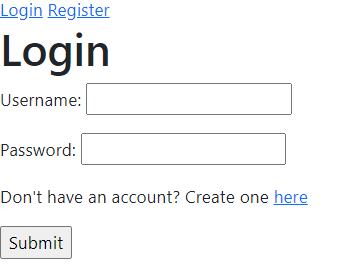
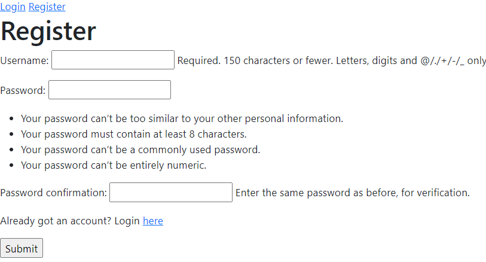
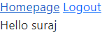

# Cloning and starting application
1. - git clone https://github.com/thapasurajk/django-react-login-signup-authentication-react-postgres.git
2. - pip install -r requirements.txt 
4. - python manage.py runserver

# Screenshots of login/register/homepage

### Login

### Register

### Homepage

